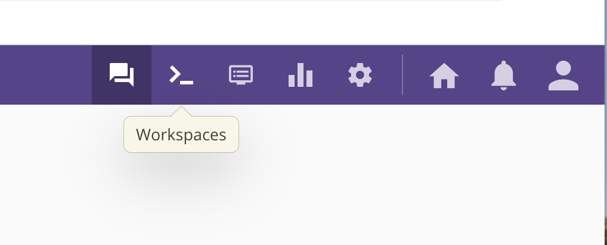

# Introduction to R/RStudio {#intro}

R is an incredibly powerful open source language for statistical analysis which we will run through RStudio. If you have never coded before, it may seem hard at first, but it will soon become easier!

 

## Find RStudio (on campus)

RStudio is available across campus in all university labs and on [BYOdevice](https://byod.sydney.edu.au).

 

## Install R and RStudio (on your own computer) {.tabset .tabset-fade .tabset-pills}

- If you can, we recommend that you install both [R](https://cran.csiro.au/) and [RStudio](https://www.rstudio.com/products/rstudio/download/) onto your own computer.

- R and RStudio are separate packages. First install R, and then install RStudio as the user interface.

- [See this DataCamp blog](https://www.datacamp.com/community/tutorials/installing-R-windows-mac-ubuntu?utm_source=adwords_ppc&utm_campaignid=9942305733&utm_adgroupid=100189364546&utm_device=c&utm_keyword=&utm_matchtype=b&utm_network=g&utm_adpostion=&utm_creative=332602034352&utm_targetid=aud-517318242147:dsa-929501846124&utm_lo) for extra instructions on installation.

### Install R

- Go to [R Project](http://cran.csiro.au/).

- Download the relevant version: Linux, Mac or Windows.

- When you are finished, you should see an icon on your desktop with a large capital `R'.

 

### Install RStudio

- Go to [RStudio](https://www.rstudio.com/products/rstudio/download/).

- Download the installer for your platform.

- When you are finished, you should see an icon on your desktop with a large RStudio.

 

### Open RStudio
- Click on the large RStudio icon.

 

## Using RStudio (if you don't have a computer, or it's not working)

#### Use the Ed Workspace in a browser

- It's easy to run a RStudio workspace on [Ed Discussion Board](https://edstem.org/dashboard).
- Datasets like the Australian Road Fataility data are already stored in Ed, in `\course\data`.
- The only downside is that you can't import your own data into Ed (for projects).

#### Use an R complier

- You can run an R compiler on a browser, on a tablet such as ipad. 
- Here is 1 example: [click here](https://rextester.com/l/r_online_compiler) 
- Again, you can't import your own data (for projects).

#### Use RStudio Cloud

- You can run RStudio in the cloud for free.
- You can import your own data.

 

#### Use RStudio on ipad

- This is relatively new, so not recommended for most students.
- [See details here.](https://levelup.gitconnected.com/using-rstudio-with-an-ipad-cb9f013bb3f)

 