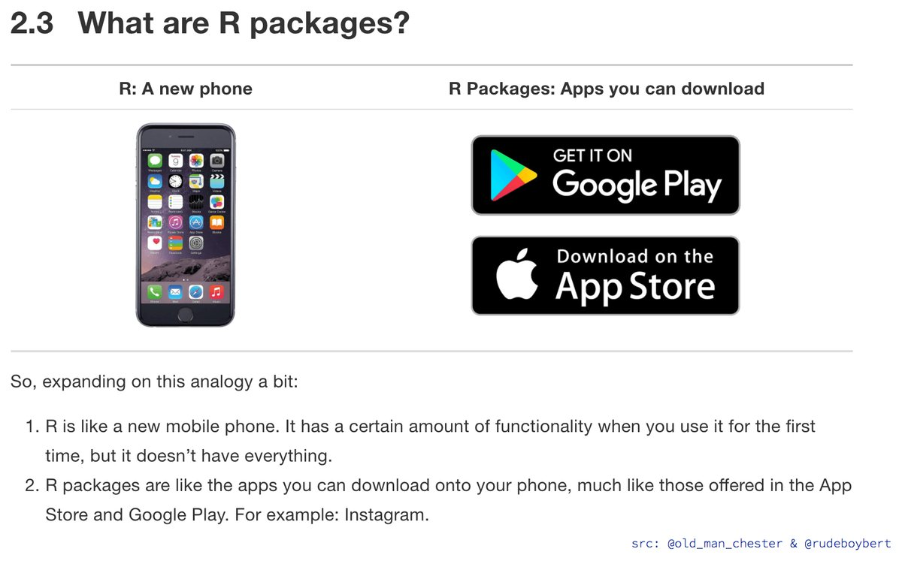

# Getting started with RStudio {#gettingstarted}

## Use RStudio as a calculator

- Go the console (usually LHS at the bottom, where you see the cursor `>`).

<div align="center">

</div>

- Copy the following commands into the bottom **Console**. After each command, press the Enter/Return key on your keyboard.

```{r, results='hide'}
1+ exp(3) + sin(0.5)
x=c(1,2,3)
x^2
sum(x)
sum(x^3)
```

- Alternatively, you can copy the commands into the top **Script Window**. Highlight all the commands, and press`Run`function. Note that the output is in the bottom **Console**.

<br>

## Experiment with data in R

Many [data sets](https://stat.ethz.ch/R-manual/R-devel/library/datasets/html/00Index.html) are already loaded into R. They are good to experiment with, and are used in the **R/LQuizzes**.

- For a list of all data available, type `data()`.

```{r,results='hide'}
data()
```


- For example, we're going to consider `mtcars`. To view the data, simple type its name.

```{r,results='hide'}
mtcars
```

<div align="center">

</div>

- Clearly this is not recommended for large data sets! Instead, look at the first or last rows using the `head` or `tail` functions.
```{r,results='hide'}
head(mtcars)
tail(mtcars, n=3)
```

- You can find out about the data by using `help()`.  

```{r, eval=F}
help(mtcars)
```

- Or, read about the [mtcars data set](https://stat.ethz.ch/R-manual/R-devel/library/datasets/html/mtcars.html).

<br>

## Get organised: course folder

It's very important to set up a neat file management system for the semester. This is best practise, and will make your life easier!

- Create a course folder on your Desktop. eg `DATA1001files`. 

<div align="center">

</div>

<br>

## Knit a given RMarkdown file

RMarkdown is a clever document/file which can save all your Rcode and comments in one place for easy editing. 

- You have been given the file `Lab1.Rmd` on your Labs page on Canvas.

- Download the file `Lab1.Rmd`, and store it in your new course folder `DATA1001files`.

<!--
<div align="center">

</div>
-->

- Double-click on the file and notice how it automatically opens in  the top LHS window of RStudio.

<!--
<div align="center">

</div>
-->

- The information at the top is called the YAML, which you can edit it: eg in `author: "xxx"`, replace your name for `xxx`.)

- Render the file using `Knit`.

<!--
<div align="center">

</div>
-->

- This will create `Lab1.html`, which you can open in a browser.  This becomes your final report.


<!--
<div align="center">

</div>

<div align="center">

</div>
-->

- You can create new RMarkdown files by duplicating `Lab1.Rmd` and renaming it `Project1.Rmd` etc.

- To customise your RMarkdown file, see 
[RMarkdown Cheat Sheet](https://www.rstudio.com/wp-content/uploads/2015/02/rmarkdown-cheatsheet.pdf)

<br>

## Neat workflow

- There is a handy way to streamline your workflow, so that the output of the `.Rmd` opens next to your input in the RStudio console. This makes it very easy to edit and see your results.

1. Open preferences

<div align="center">

</div>

2. Select R Markdown

3. Select 'Viewer Pane'

4. Click 'Apply'

<div align="center">

</div>

- Now knit your `LabDemo.Rmd'`file and see what happens - neat!

<div align="center">

</div>

- This will remain the setup for next time you open RStudio.

<br>

## Install packages

**What to do if a package is missing?**

- Suppose you try and knit your .Rmd, only to face the error below:

`Error in library(somepackage) : 
  there is no package called somepackage
  
(Note, of course, `somepackage` is being used as a place holder here! Replace with the name of the actual package that is missing). 
 
- No need to fret! All we need to do is install the package `somepackage` from CRAN, which is a repository for R packages. 

- What is an R package? Good question. You can think of an R package like an app on the app store : it contains sets of functions that allow R to have extra functionality. For example, R was at the beginning, designed to be used very much like a calculator (very basic!). To be able to `knit` reports, we need new packages to enable R to extend its capabilities beyond the most basic packages downloaded with R. 

<div align="center">

</div>

- CRAN is very much like the App store - but for R!

- So how do we access CRAN? Right through the command line!

- In the console in R, you simply need to type

`install.packages("somepackage")`

- And R automatically searches and downloads for that package on CRAN. You can then try knitting your report again! Sometimes, more than one package will be missing - if this is the case - just repeat the steps above until they are all installed.

In summary:

- If want to use a certain package, use the following code. This is a 1 off step. It will now appear in the list of packages in the bottom LHS window.

```{r,eval=F}
install.packages("somepackage")
```

- Then every time, you start a new .Rmd document, or session in R, you need to call up the package by using `library`.

```{r,eval=F}
library("somepackage")
```

<br>
