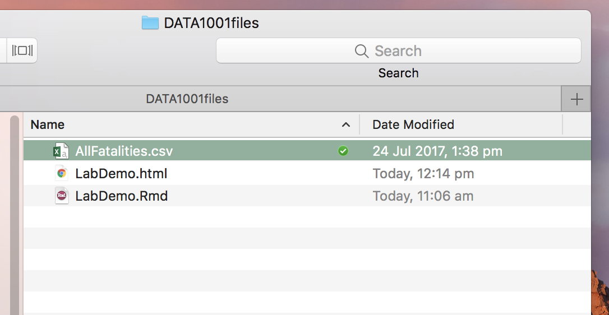
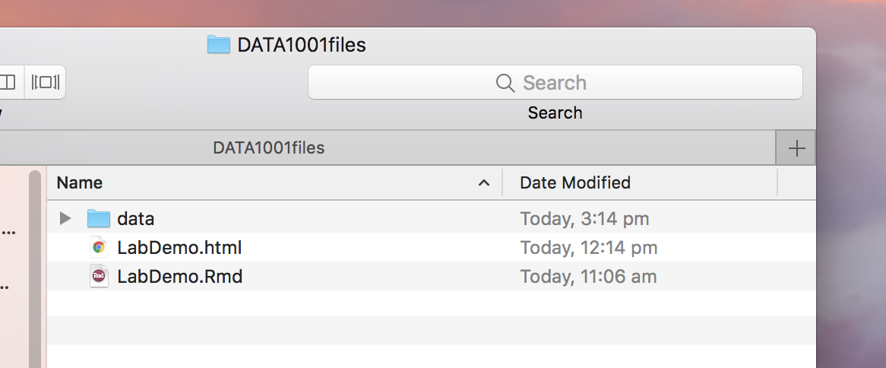
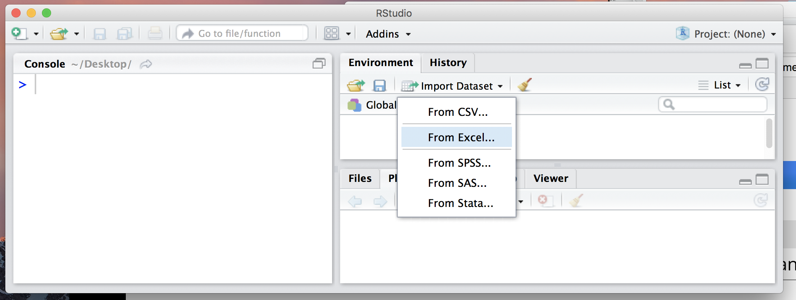
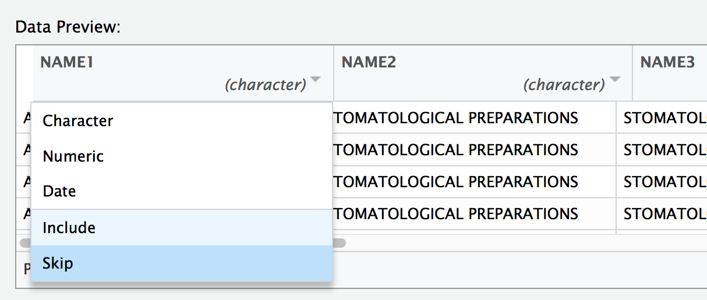
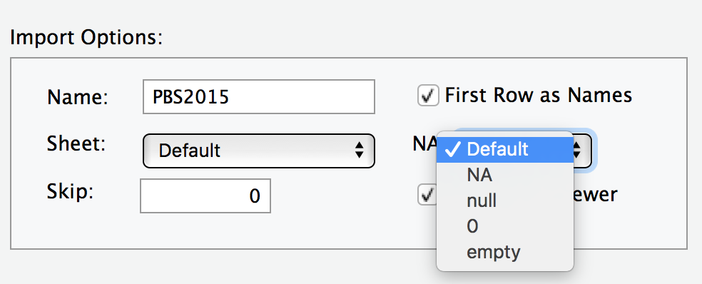
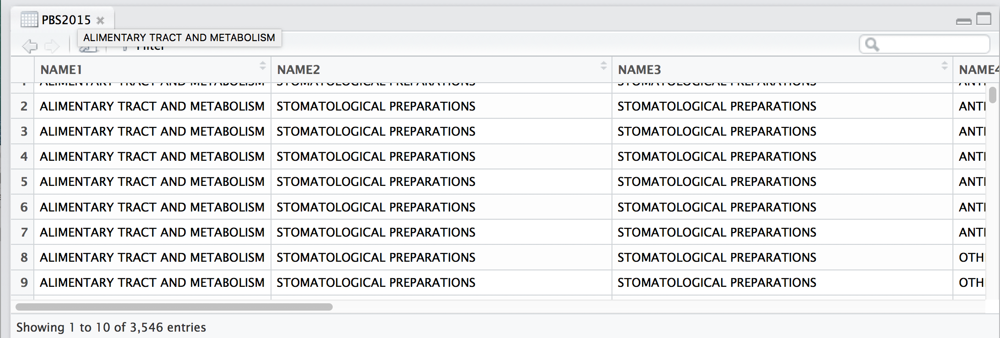
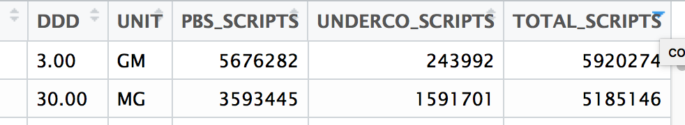

# Import data into R {#importdata}

<div align="center">

</div>

There are so many different ways to import data into R, so you have lots of options.
It can be confusing at first. So just experiment with the different methods below, and find what suits you!


## From the internet

You can import data directly from the web. 

- If you right click on the datasets in Canvas, you'll get the url. For example, see Lab2 `Road`.

```{r eval=F}
road = read.csv("http://www.maths.usyd.edu.au/u/UG/JM/DATA1001/r/2018S1/data/AllFatalities.csv")
```

- This is a super easy method, which we will use in the labs. However, it doesn't work if your data doesn't have an url (eg finding your own data for a Project).

<br>


## From your folder

-  Download a data set from the Canvas Lab page, for example `AllFatalities.csv` from Lab2.

- Put the datafile into the`DATA1001files` folder where your `.Rmd`. file is located.

<div align="center">

</div>

- Read the data into RStudio.

```{r eval=F}
# Given file.csv
road = read.csv("AllFatalities.csv")
```

<br>

## From a data subfolder

- Longer-term when you have more data files, it can be useful to create a sub folder called `data` within your `DATA1001file` folder.

<div align="center">

</div>

<div align="center">

</div>

- Now you can store all your data inside `data` and then read your data straight into R. 

```{r eval=F}
# Given file.csv
road = read.csv("data/AllFatalities.csv")
```


Note: This method works well, unless your working directory is not pointed at your DATA1001files folder. ie Your computer needs to know where to get the data file from. See the next section for how to set your working directory to your DATA1001files folder, if it is currently pointing somewhere else.

<br>

## Using file.choose() and working directories

The **working directory** is where RStudio is pointing, ie where it is draws files from and where it save files to.

- It is generally best practise to store your data near your .Rmd file in the DATA1001files folder. In that case, if you open the .Rmd file directly from there, RStudio will set the working directory to that folder.
- However, if you are not sure what's happening with your working directory ... here's one easy plan!.


(1) Check where your current working directory is

```{r,eval=F}
getwd()  # This gives the current working directory
```


(2) Ask RStudio to browse the files on your computer. This will give you the file pathway (ie where the file is stored). 


```{r,eval=F}
file.choose()  # Choose your file, and then R gives you the pathway to that file
```


For example, for Mac users some possible paths might be:
<br>
desktop: "/Users/johnsmith/Desktop"
<br>
folder on desktop: "/Users/johnsmith/Desktop/DATA1001"
<br>
dropbox: "/Users/johnsmith/Dropbox"


(3) Set the working directory to that path.

```{r,eval=F}
setwd("...") # set the working directory to the folder where your file is saved (from the pathway in (2)
```

(4) Read your data in 

```{r,eval=F}
data = read.csv("2016Fatalities.csv")  # read the data straight into R from that folder
```

Note: Students often find working directories confusing at first! But once you have mastered it, it becomes straightforward.

<br>

## Using Import dataset

Another way to import data, is to use the "Import Datatset" tab in RStudio.

<div align="center">

</div>

<!--

- Select `Import Dataset` under the `File` tab. Select what type of file `From CSV` or `From Excel`.

- `Browse` your files and then click  `Import`.
Note: The `Code Preview` at the bottom of this pop-up, shows you the direct way to upload data.

- R will upload all the variables, unless you specify otherwise.


<br>
- R will code missing values as NA, unless you specify otherwise.



<br>
- View the data.



<br>
- Sort the whole data set by a particular column, by clicking at the top of that column.


-->

<br>

## Note about Excel files

- Note: If your file is in Excel format `PBS2015.xlsx`, then you need the package `readxl` to first be installed. For example, consider this Excel data [here](http://www.maths.usyd.edu.au/u/UG/JM/DATA1001/r/current/data/PBS2015.xlsx).

```{r eval=F}
# Given file.xlsx
install.packages("readxl")  # You only need to do this once in RStudio
library(readxl)  # You need to do this each time
data = read_excel("data/PBS2015.xlsx")
```

<br>

## More info

This free [Data Camp course](https://learn.datacamp.com/courses/introduction-to-importing-data-in-r) is good!

<br>


## Data Wrangling **

Data preparation is an essential part of statistical analysis and can be very time-consuming. It can involve cleaning or tidying, cleansing scrubbing, reshaping, reforming, splitting and combining. It must be performed carefully and transparently.

- The aim is to change Messy (or Raw or Dirty) Data into Clean Data, which is correctly and consistently formatted and ready for analysis.This can involve removing redundant or useless information, standardising information (like calendar dates), separating or combining columns, and dealing with warnings.

- Simple data can be cleaned in Excel. Get rid of any extra formatting, so that the data looks like:

|ID (if applicable)|Variable1|Variable2|Variable3|
|---|---|---|---|
|1|14|25|34.4|
|2|15|23|19.7|
|||||

- More complex cleaning can be done through a [package](http://tidyverse.org/) like `tidyverse`. Install the package, as a one off command.
```{r,eval=F}
install.packages("tidyverse")
```

- Each new session of RStudio, you will need to load the package.

```{r,eval=F}
library("tidyverse")
```

- See [cheat sheet](https://www.rstudio.com/wp-content/uploads/2015/02/data-wrangling-cheatsheet.pdf) and [article](https://cran.r-project.org/doc/contrib/de_Jonge+van_der_Loo-Introduction_to_data_cleaning_with_R.pdf)

<br><br>
