# More tests for relationships (Diagnostics) {#morerelationships}

We can use hypothesis tests to test the assumptions of other hypothesis tests!

<br>


## Test normality for 1+ populations: histogram, QQ-plot, Shapiro-Wilks Test

Here we illustrate using the car weights.

(1) Check the **histogram**.
```{r, hidden='true',fig.show='hide'}
hist(mtcars$wt, main = "Histogram of Car Weights", freq=F)
```

- Note: The histogram is roughly normal (roughly balanced around one mode towards the centre).

<br>

(2) Check the **QQ-plot**.

- A QQ-plot is another summary for quantitative variables. Further information can be found [here](https://en.wikipedia.org/wiki/Q-Q_plot).

```{r}
help(qqnorm)
```

```{r, hidden='true', eval=F}
qqnorm(mtcars$wt, main = "QQ-plot for Car weights")
qqline(mtcars$wt, col = "blue")
```

- Note: The data is reasonably evenly scattered around the theoretical quantile-quantile line which suggests that the car weights are reasonably normally distributed.

<br>

(3) Test using the **Shapiro-Wilks Test**

- Warning! [The Shapiro-Wilks normality test](https://academic.oup.com/biomet/article-abstract/52/3-4/591/336553?redirectedFrom=fulltext) is sensitive to sample size. Small samples will nearly always pass normality tests. Therefore, it is recomended to use both visual inspection and a significance test to decide whether a dataset is normally distributed.

- **H:** 
    - $H_{0}$ : The data is *normally* distributed. 
    - $H_{1}$ : There data is *not normally* distributed. 
    - We hope to retain $H_{0}$! 

- **T,P&C:**

```{r, hidden='true', eval=F}
shapiro.test(mtcars$wt)
```

Note: The p-value is much greater than 0.05, so strong evidence that the data is normally distributed. 

<br>

## Test equal variance of 2 populations (Boxplots; F-test; variance ratio) 

(1) Compare the **2 boxplots**.

```{r, hidden='true', eval=F}
boxplot(extra~group, data = sleep)
```

- Note: It is clear from the boxplots that the variation in group 1 is less than group 2. 

- Boxplots are a very useful tool as they provide an indication of whether the sample means are similar or different, whether the samples are normally distributed, and whether the variances are similar between the 2 samples.

(2) Test using the **Variance Test (Levene)** 

- **H:**
    
    - Let $\sigma_1^2$ = variance of the group 1 drug.

    - Let $\sigma_2^2$ = variance of the group 2 drug.

    - $H_{0}$ : There is no difference: $\sigma_1^2=\sigma_2^2$ 

    - $H_{1}$ : There is a difference: $\sigma_1^2 \neq \sigma_2^2$ 
    
    - We hope to retain $H_{0}$! 

    
- **T,P&C**

```{r, hidden='true', eval=F}
var.test(extra~group, data = sleep)
```


Note: From the variance test, it is clear that the p-value is much greater than 0.05. Therefore we retain the null hypothesis and conclude that the variances seem to be equal. 


<!--
## Test normality for 2 populations: histogram, QQ-plot, Shapiro-Wilks Test

- Produce a **histogram** of the increase in hours of sleep.
```{r, hidden='true',fig.show='hide'}
par(mfrow = c(1,2))
hist(sleep$extra[sleep$group==1], main = "Group1", xlab = "Increase in hours of sleep", freq=F)
hist(sleep$extra[sleep$group==2], main = "Group2", xlab = "Increase in hours of sleep", freq=F)
```

<br>

While there appears to be no significant skew in the group1 or group2 data, it is rather hard to tell as the sample size is small. Therefore, it is useful to look at a number of other ways to check the normality assumoption.

<br>

- Produce a **QQ-plot**
A QQ-plot is another summary for quantitative variables. 

Read the help for the qqnorm function. Further information can be found [here](https://en.wikipedia.org/wiki/Q-Q_plot).

```{r}
help(qqnorm)
```

Produce a **QQ-plot** for the sleep data.
```{r, hidden='true'}
par(mfrow = c(1,2))
qqnorm(sleep$extra[sleep$group==1], main = "Group1")
qqline(sleep$extra[sleep$group==1], col = "blue")
qqnorm(sleep$extra[sleep$group==2], main = "Group2")
qqline(sleep$extra[sleep$group==2], col = "blue")
```

<br>

The plots show that the data is reasonably evenly scattered around the theoretical quantile-quantile line which suggests that the data is reasonably normally distributed.

<br>

- Test using the **Shapiro-Wilks Test**

Warning! [The Shapiro-Wilks normality test](https://academic.oup.com/biomet/article-abstract/52/3-4/591/336553?redirectedFrom=fulltext) is sensitive to sample size. Small samples will nearly always pass normality tests. Therefore, it is recomended to use both visual inspection and a significance test to decide whether a dataset is normally distributed.

- $H_{0}$ : The data is *normally* distributed. =(We hope to retain $H_{0}$.)

- $H_{1}$ : There data is *not normally* distributed.

```{r, hidden='true'}
shapiro.test(sleep$extra[sleep$group==1])
shapiro.test(sleep$extra[sleep$group==2])
```

In both cases the p-value is much greater than 0.05 so the data is likely to be normally distributed.
-->


<!--
## Get organised

It's very important to set up a neat file management system for the semester. This is best practise, and will make your life easier!

### Create a course folder [one-off]

- Create a course folder on your Desktop. eg `DATA1001files`. 

<div align="center">

</div>

### Create a project  [one-off]

- Create a project and save it as `DATA1001` in `~Desktop/DATA1001files`.

<div align="center">
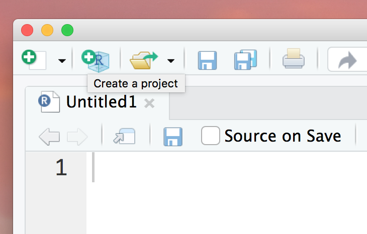
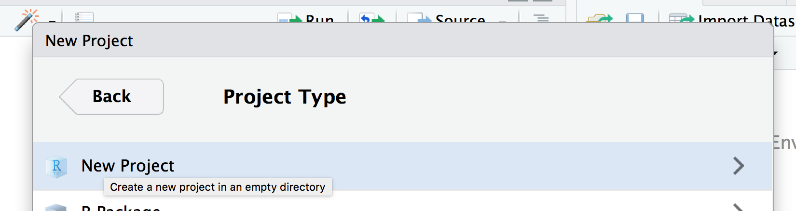
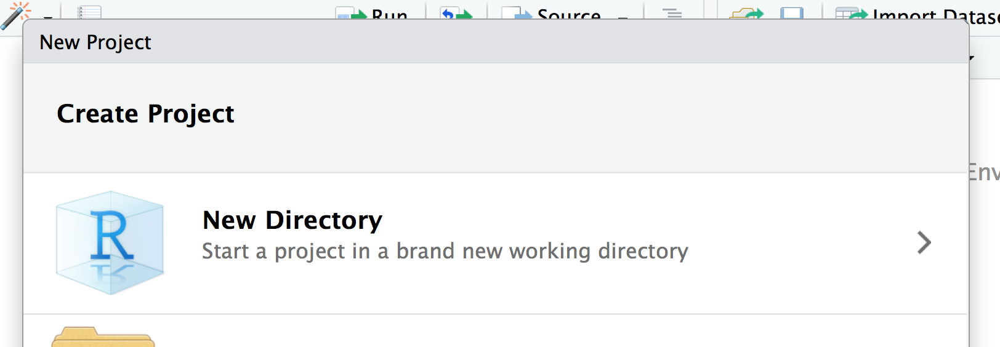
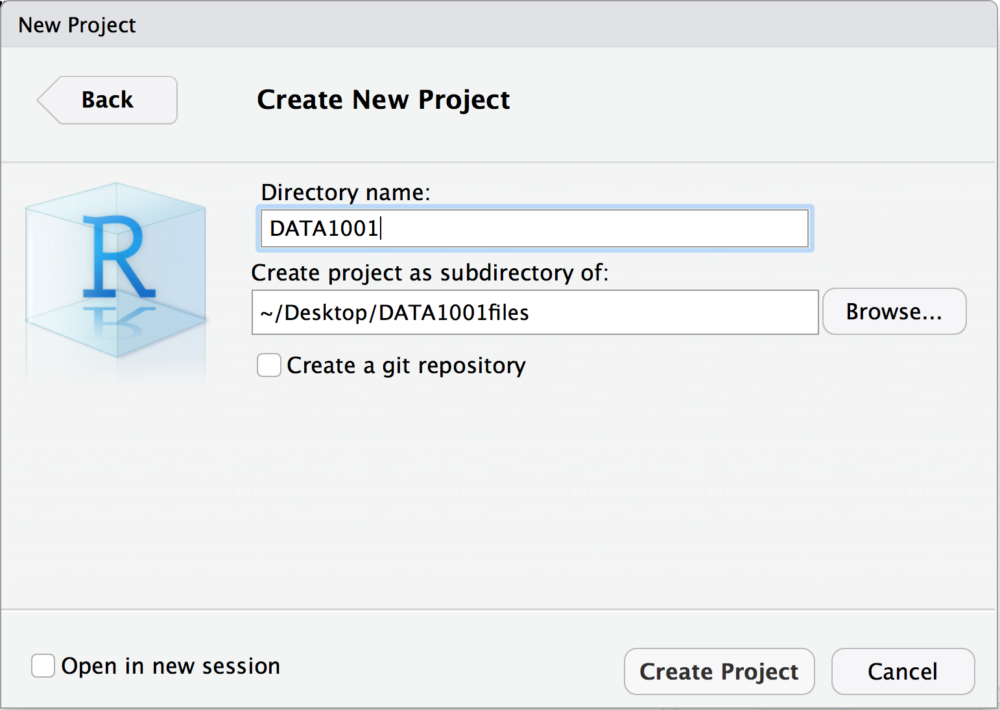
</div>

- It will appear in your Files in RStudio as `DATA1001.Rproj`.

<div align="center">

</div>

- It will also appear as a sub-folder (containing DATA1001.Rproj) in the `DATA1001` folder.

<div align="center">
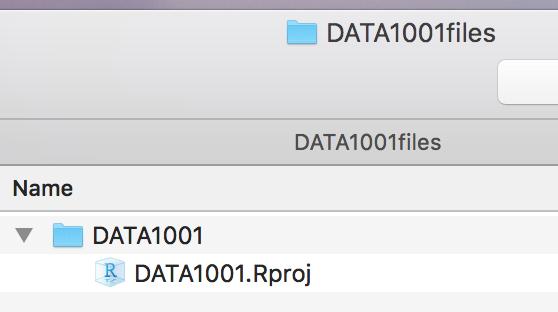
</div>

### Create a data folder  [one-off]

- Create a subfolder in the `DATA1001` folder called `data` to keep all your datasets.

- You should end up with the following file hierachy, which we'll use all semester.

<div align="center">
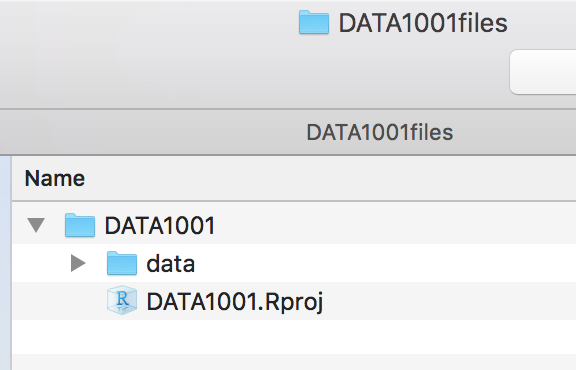
</div>

- The good thing about having a project, is that when you open it, all the linked files (eg data) automatically open in RStudio.

- Store your  `Lab1.Rmd` file in the `DATA1001` folder, so that it is linked to the project.

<br>

### Create your own RMarkdown document (for a Project or Lab)

- The easiest way to create new RMarkdown files is to duplicate `Lab1.Rmd` and rename it `Lab2.Rmd` or `Project1.Rmd` etc.

- Alternatively , you can follow the steps below.

    - Open your project (this needs to be done at the beginning of each new session in RStudio).


    - Create a new .Rmd file by either duplicating the given `Lab1.Rmd` file, or by following th stopes 

<div align="center">
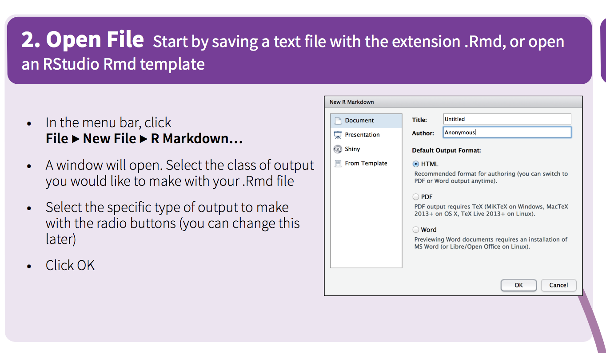
</div>

    - You will have an example file, which you can edit. 

<div align="center">
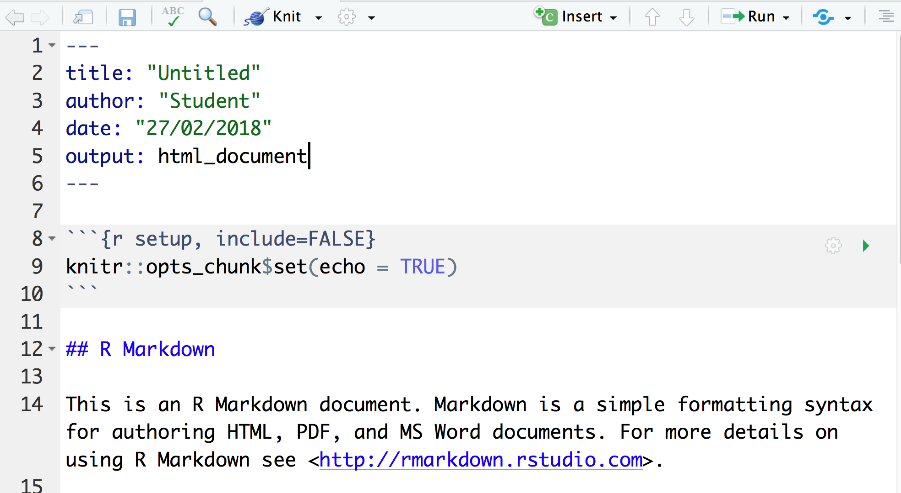
</div>

    - Name the file: `Lab1.Rmd`.

<div align="center">
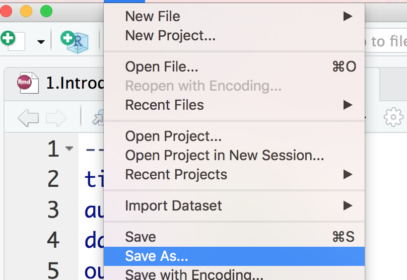
</div>

    - Render  the file using `Knit`.
<div align="center">
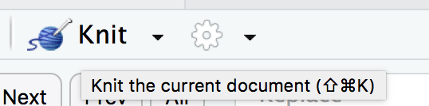
</div>

    - This will create `Lab1.html`, which you can open in a browser. 
\
<div align="center">
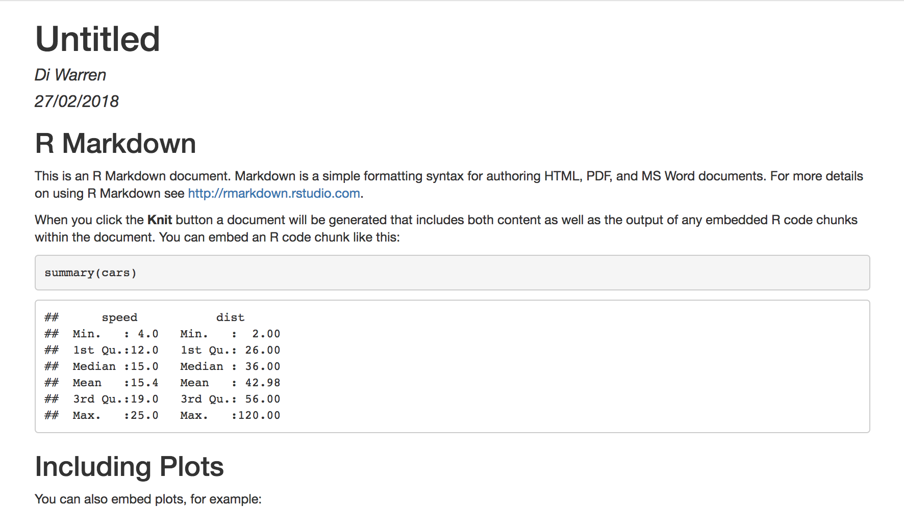
</div>

    - It will appear in your `DATA1001files/DATA1001` folder as `Lab1.html`.
<div align="center">
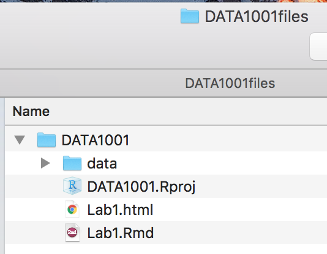
</div>

<br>

## It's easy from then!

- Once you have set up your project `DATA1001.Rproj`, then in subsequent Labs all you need to do is open that project, and then create a new RMarkdown document, eg `Lab2.Rmd`. 
- Everything will automatically be stored in the `DATA1001` folder, as the project sets that as the working directory.

--->


<!-- See for example  and some of the articles cited therein: 

Moser, B.K. and Stevens, G.R., 1992. Homogeneity of variance in the two-sample means test. The American Statistician, 46(1), pp.19-21.

Ruxton, G.D., 2006. The unequal variance t-test is an underused alternative to Student's t-test and the Mann-Whitney U test. Behavioral Ecology, 17(4), pp.688-690.
-->


<!--

- The following table records hair and eye colour for both male and female statistics students, from the  `HairEyeColor` dataset.

- To simplify things we use the `apply` function to combine gender into one class.

```{r, hidden=T, warning=F, message=F}
# Male and Female separate tables
HairEyeColor

# Male and Female combined into 1 table
require(knitr)
HairEyeColor1 <- apply(HairEyeColor, c(1, 2), sum)
HairEyeColor1
kable(HairEyeColor1)
```

A nice way to plot categorical data is the mosaic plot. The size of each block is in proportion to the cell frequency in the "contingency" table. Generally we can say that if the gaps between the blocks line up, then the data is independent. More on this later!

Cell frequency: number of individuals in a group i.e. females with brown eyes and brown hair.

Contingency table (two way table): Is a table that is used to summarize the relationship between several categorical variables.

```{r, hidden=T}
mosaicplot(HairEyeColor1, main = "Relation between hair and eye color", shade = F)
```

One of the key reasons for collecting such data is to look for relationships or lack of relationships between the categories. For example, do more blond haired people have blue eyes than expected?

The key word in this sentence is **expected**. Let's take a look at a simple example to understand what this means. Let's say that we conduct a simple survey of 100 people, 50 male and 50 female. Of the 100 people surveyed, 60 answer yes and 40 answer no. Then we would expect 30 of each females and males to answer Yes (total 60) and 20 of each to answer no (total 40). 

This might remind you of the probability lessons where, in this case, we can think of the the totals columns as determining the probability of answering yes or no (0.6 and 0.4 respectively). In this example, we also would expect that the probability is the same for females and males. So if we ask 50 females the question we would expect 30 to answer yes and 20 to answer no as with the males. We can easily calculate the expected frequency using the following formula:

$Expected = \frac{RowTotal \times ColumnTotal}{GrandTotal}$

---|Yes|No|Total
---|---|---|---
Female|30|20|50
Male|30|20|50
Total|60|40|100

After we go out and do the actual survey we get the following values

---|Yes|No|Total
---|---|---|---
Female|40|10|50
Male|15|35|50
Total|60|40|100

It looks as though more females answered yes to this question and more males answered no. The question is whether this difference from the expected values is big enough to assume that females preference is different from males, or is it purely by random chance? 

This is where the chi-squared statistic $(\chi^2)$ comes in useful. Using it we can determine the probability of whether the observations are independent of each other (you can think of it like the two sample populations follow different probabilities, one is weighted towards yes and the other no). Like with the t-test, the bigger the value of $(\chi^2)$ the smaller the probability that the two sample populations are dependent. This brings a new test the chi-squared test aka Pearson's chi-squared test.

The Pearson's chi-squared test is a very versatile test and can be used to:

1. Test the goodness of fit of a distribution to theoretical distribution (similar purpose to the Shapiro-Wilks test for normality) or model. In the goodness-of-fit test there is only one observed variable!

2. Test for homogeneity.

3. Test for independence.

The test statistic itself is 

\[\chi^2=\mbox{Sum of}[ \frac{(\mbox{Observed frequency - Expected frequency})^2}{\mbox{Expected frequency}} ] \]

Basically it is a measure of the weighted distance between the observed and expected values. The bigger it is the more likely it is that the observed and expected values are not the same.

-->
