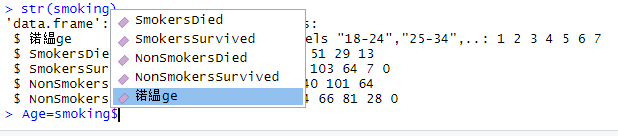

# FAQs {#faq}

## Why am I getting weird variable names? {-}

<div align="center">

</div>

Unfortunately this can happen on windows computers.You can fix it with the following code

```{r,eval=F} 
names(smoking)[1] = "Age"
```

This code looks at the column names, picks the first one, and then reassigns it to Age.


## How do I produce a residual plot with missing values in data? {-}

```{r , warning=F, message=F, eval=F}
library(ggplot2)
help(msleep)
plot(sleep$bodywt, sleep$brainwt)
L = lm(sleep$brainwt ~ sleep$bodywt)
summary(L)
abline(L)

# Correlation (with missing values)
length(sleep$bodywt) 
length(sleep$brainwt) 
cor(sleep$bodywt, sleep$brainwt, use = "complete.obs")  


# Residual plot (with missing values)
length(sleep$bodywt) 
length(L$residuals)
residuals1 = resid(lm(sleep$brainwt ~ sleep$bodywt, na.action=na.exclude)) 
length(residuals1)
plot(sleep$bodywt,residuals1)
```

## What does %>% mean? {-}


## What how do you select certain rows of a dataset? {-}

## How can you find the mean of different groups in a dataset? {-}


